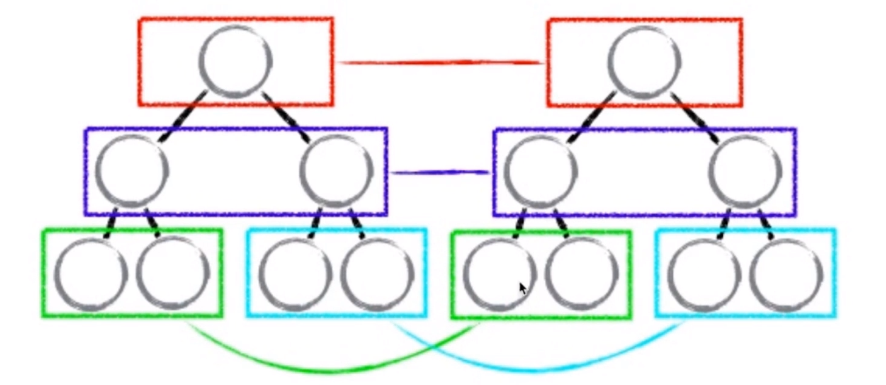
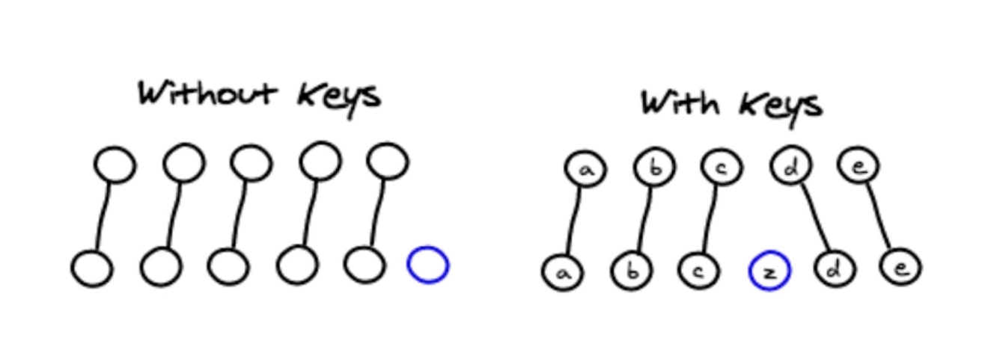
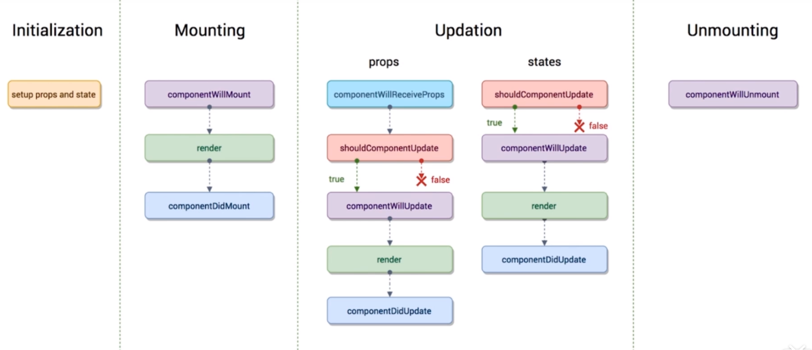
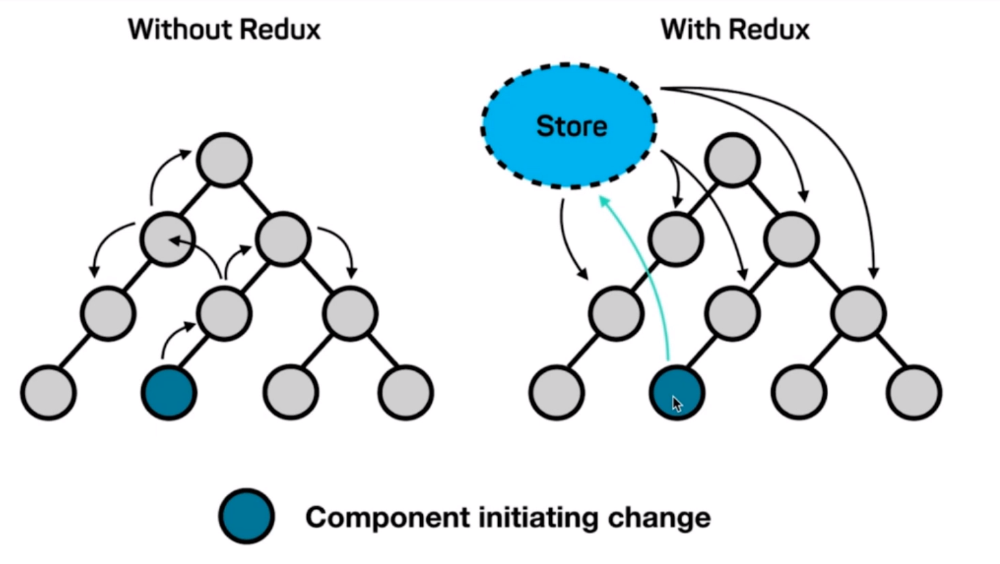
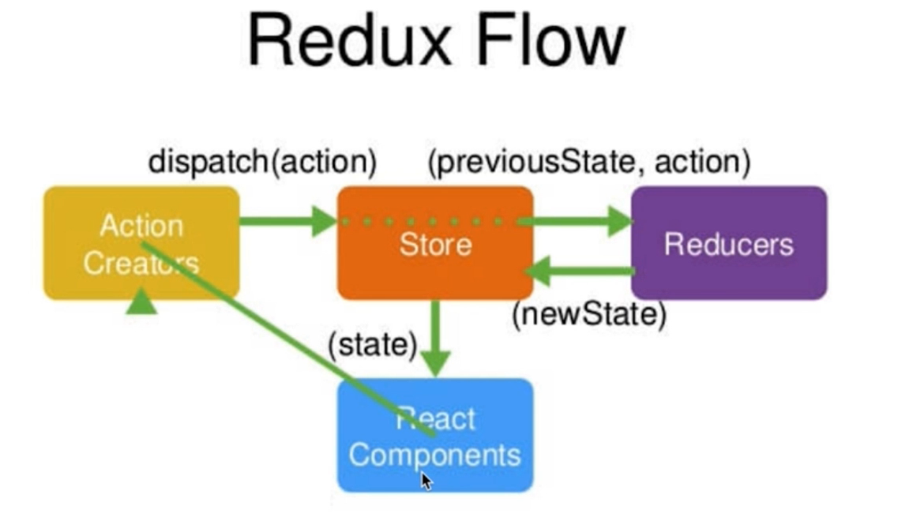
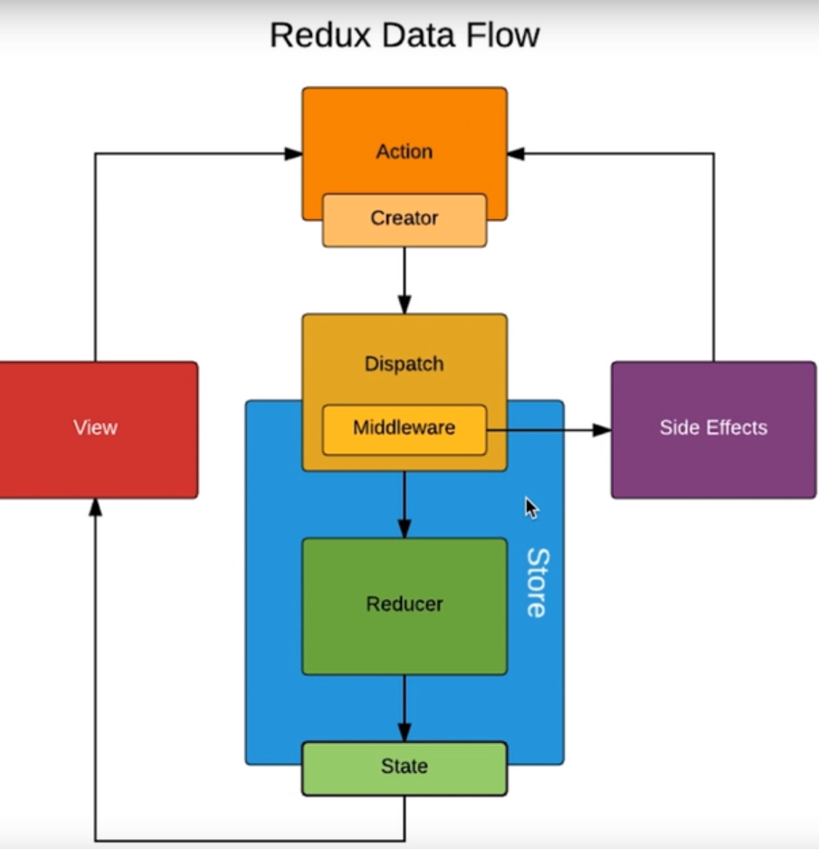

[TOC]

## React Fiber(React)

React Fiber指的是react 版本16之后，因为加入了**事件优先级**，所以称版本为16之后的为**React Fiber**

安装react脚手架工具create-react-app

~~~javascript
cnpm install -g create-react-app //首先安装全局的

create-react-app my-app

npx create-react-app my-app
cd my-app
cnpm start

两种写法
Fragment相当于一个占位符，既满足return需要一个跟节点，又满足在浏览器上不显示标签
import React,{Fragment，Component} from 'react';

class App extends Component {
    render(){
      return (
        <Fragment>
          <input type="text"/> <button>提交</button>
          <ul>
            <li>学英语</li>
            <li>养小狗</li>
          </ul>
        </Fragment>
  		);
    }
}

export default App;

2.
import React,{Fragment} from 'react';

function App() {
  return (
    <Fragment>
      <input type="text"/> <button>提交</button>
      <ul>
        <li>学英语</li>
        <li>养小狗</li>
      </ul>
    </Fragment>
  );
}

export default App;
~~~

react中有jsx语法例如html标签引入，一般使用jsx语法需要在对应的文件下**import React from ‘react’**

+ jsx

1. jsx是在js文件中写html标签

2. jsx如果要是用自己定义的html标签，首字母必须大写

3. jsx在js中写标签，不需要单引号或双引号，可以直接写标签

4. jsx如果要写js表达式外面需要套个{}

5. 注释{/* XXX */}

6. label中的for要用htmlFor来表示，class要用className来表示，如果input内容不需要转义需要用

   ~~~javascript
   dangerouslySetInnerHTML={{__html:item}} //item自己定义内容一般都是用来显示循环的li标签
   
   ~~~

------

### 事件响应式以及事件绑定

+ 在Vue中通过数据劫持的方法，给每个属性添加getter与setter方法来监听数据改变，一旦数据发生改变则通知watcher，然后watcher调用update（）方法来更新界面

先通过代码来观察变化

~~~javascript
import React,{Fragment,Component} from 'react';

class App extends Component{
    constructor(props){
        super(props);
        this.state={   
            inputValue:'',
            list:[]
        }
    }
      render() {
        return (
            <Fragment>
              <input
                  value={this.state.inputValue}
                  onChange={this.handleInputChange}
                  type="text"/>
              <button>提交</button>
              <ul>
                <li>学英语</li>
                <li>养小狗</li>
              </ul>
            </Fragment>
        );
    }
    handleInputChange=(e)=>{
        this.setState({
            inputValue:e.target.value
        })
    }

}

export default App;

~~~

1. 首先如果在jsx中绑定事件舰艇函数，必须是驼峰原则

2. 如果要初始化数据，需要先继承父类Component，存放数据是在state中的

3. ~~~javascript
       handleInputChange=(e)=>{ //通过箭头函数防止this指向改变变成undefined
           this.setState({ //当要修改state中的数据时不能直接this.state.xxx而是需要在this.setState中改变，如果不是修改的话可以直接调用this.state.xxx来读取内容
               inputValue:e.target.value
           })
       }
   ~~~

------

### 事件传参

~~~javascript
jsx中的循环
render() {
    return (
            <ul>
                {
                    this.state.list.map((item,index)=>{
                        return(
                            <li
                                key={index}
                                onClick={()=>this.handleItemDelete(index)}
                            >
                                {item}
                            </li>
                        )
                    })
                }
            </ul>
		)
	}
    handleItemDelete=(index)=>{
        // console.log(index)
        const list = [...this.state.list]
        list.splice(index,1)
        // console.log(list)
        this.setState({
            list:list
        })
       //优化1
        this.setState(()=>({
            list
        }))
        //优化2
        this.setState(()=>{
            return{
                list
            }
        })
    }
~~~

当事件需要传参的时候，如果处理不当，会立即执行

传参的三种方式

~~~javascript
1.
<button onClick={this.handleBtnClick.bind(this,"abc")}></button>
定义handleBtnClick方法
handleBtnClick(name){
    ....
}
2.
<button onClick={this.handleBtnClick("abc")}></button>
定义handleBtnClick方法
handleBtnClick=(name)=>{
    return ()=>{
        ...
    }
}
   
3.
    <button onClick={()=>this.handleBtnClick("abc")}></button>
    定义handleBtnClick方法
    handleBtnClick=(name)=>{
		...
    }
~~~

------

### 组件之间的传值

在Vue中父子组件的传值

通过父组件向子组件绑定值（：xxx=“xxx”）,绑定方法(@xxx="xxx")

子组件通过props来接受数据props:['xxx'],或者详细写法props:{xxx:{type:String,required:true}}

子组件触发父组件的方法，通过this.$emit('xxx',值)

=======================================================================================

在react中通过**this.props**来获取父组件向子组件传递的值

~~~javascript
父组件
import TodoItem from './TodoItem'
...

    <TodoItem 
        item={item} 
        index={index} 
        handleItemDelete={()=>this.handleItemDelete(index)}>
    </TodoItem>

子组件
import React,{Component} from 'react'
import PropTypes from 'prop-types'
class TodoItem extends Component{
    constructor(props){
        super(props)
    }
    render(){
        return (
            

                {this.props.item}
            

        )

    }
    handleDelete=()=>{
        // console.log(this.props.index)
        this.props.handleItemDelete(this.props.index)
    }

}
//强定义类型
TodoItem.propTypes={
    test:PropTypes.string.isRequired,
    item:PropTypes.string,
    handleItemDelete:PropTypes.func
}
TodoItem.defaultProps={
    test:"hello world"
}
/**
写在class类里，给组件类添加对象
static propTypes={
    test:PropTypes.string.isRequired,
    item:PropTypes.string,
    handleItemDelete:PropTypes.func
}
*/
export default TodoItem

~~~

#### props state render()关系

props或者state值改变了，render()函数就执行一次，所以就会有数据改变了，视图也跟着改变

------

### 虚拟DOM与diff算法

+ 虚拟DOM就是个js对象

  在react中实现虚拟DOM的步骤

1. state数据
2. JSX模板，然后通过React.createElement("标签名",{id=“xxx”...},"标签值")来生成JS对象，也就是虚拟DOM
3. 生成虚拟DOM(虚拟DOM就是个JS对象，用它来描述真是DOIM) (损耗了性能)
4. 数据 + 模板 生成真实的DOM，并显示
5. state数据改变
6. 数据 + 模板 生成新的虚拟DOM(通过生成新的JS对象，极大的提升性能，因为没有虚拟DOM话，是要生成真实DOM)
7. 比较原始虚拟DOM与新的虚拟DOM的差别，通过diff算法找到区别，并修改
8. 直接 操作DOM，显示新的DOM

+ diff算法

1. diff算法是同层之间比较，并且只比较一层，当你第一层不一样时，他就不比较下面的了，直接删除第一层以下的所有节点，并将新的虚拟DOM修改到原始虚拟DOM，虽然这样做在渲染虚拟DOM上不是很好，但是算法简单，节省了比较时间
2. react中触发diff算法一般都是在setState这个异步函数中进行的，当多个setS塔特、调用时，react会将多个setState当成一个，生成一个虚拟DOM，进行一次比较，而不会多次生成虚拟DOM
3. key值是唯一的，且循环时最好不要用index作为key值，因为index会改变，二key需要稳定的，当前几个的值未被改变时，只添加一个新的属性值，那么绑定了key值就会节省比较的时间优化性能，而为绑定key值则会重新比较，相对来说会消耗性能

------

### ref

~~~javascript
 <input
    value={this.state.inputValue}
    onChange={this.handleInputChange}
    type="text"
    ref={(input)=>{this.input=input}}
/>
//函数部分通过this.input来拿到DOM节点
    handleInputChange=(e)=>{
        // this.setState({
        //     inputValue:e.target.value
        // })
        //优化
        // const value=e.target.value
        const value=this.input.value
        this.setState(()=>({
            inputValue:value
        }))
    }
~~~

ref在V16后是以一个函数来表示

------

### 生命周期函数

生命周期函数是指在某一时刻自动调用的函数

每个组件都会有生命周期函数

render()函数就是一个生命周期函数，他在state或props改变时，自动调用该函数渲染页面

分为4部分：

+ Initialization初始化

> 数据的初始化

+ Mounting挂载

> componentWillMount //组件即将挂载在页面前调用  **只进行一次** 也能写Ajax但是以后高深技术可能会有冲突
>
> render（）//渲染页面，以及state或者props改变的时候调用
>
> componentDidMount//组件挂载后自动执行 **只进行一次**  Ajax常用写在这里

+ Update数据更新

> componentWillReceiveProps //在组件调用父组件传递的props，当这个组件第一次存在与父组件中，不会执行，如果组建已经存在与父组件中，才会执行
>
> shouldComponentUpdate //组建在更新之前执行，返回一个布尔值
>
> componentWillUpdate //组件更新之前执行，不过在shouldComponentUpdate 之后，根据shouldComponentUpdate 的值，如果true，则执行否则不执行
>
> render（）//渲染页面，以及state或者props改变的时候调用
>
> componentDidMount//组件挂载后自动执行

+ Unmounting剔除

> componentWillUnmount
>
> //在组件被剔除后执行

#### 借用shouldComponentUpdate 生命周期函数来避免子组件重复无谓的渲染

不过只能用于性能优化，浅层比较，官网有详细说明<https://zh-hans.reactjs.org/docs/react-component.html>

案例场景：当父组件的输入框输入是，在父组建里的子组件也会重新的渲染，但子组件的值并为改变，因此造成不必要的渲染

~~~javascript
shouldComponentUpdate (nextProps,nextState){ //函数带有两个参数一个是下一个传递给自组建的参数，一个是通过nextState.xxx与this.state.xxx进行比较
 return nextProps.item !== this.props.item;
}
~~~

------

### react-transition-group

react动画效果第三方模块包

~~~javascript
cnpm install react-transition-group --save

import {CSSTransition，TransitionGroup} from 'react-transition-group'

<CSSTransition
        in={this.state.show}//判断条件，根据true/false来执行动画
        timeout={300}//播放动画时间300ms
        classNames="alert"//定义了这个在CSS中就要alert-enter，跟Vue中定义了name一样
        unmountOnExit//一些钩子函数
        onEnter={() => setShowButton(false)}
        onExited={() => setShowButton(true)}
        appear={true}//页面刚显示就会有动画效果
>
	需要包裹的单个标签    
</CSSTransition>

//如果用动画组的话里面需要在包裹一个CSSTransition
<TransitionGroup>
    <CSSTransition
//如果是动画组，那么这个in就不需要添加
        //in={this.state.show}//判断条件，根据true/false来执行动画
        timeout={300}//播放动画时间300ms
        classNames="alert"//定义了这个在CSS中就要alert-enter，跟Vue中定义了name一样
        unmountOnExit//一些钩子函数
        onEnter={() => setShowButton(false)}
        onExited={() => setShowButton(true)}
        appear={true}//页面刚显示就会有动画效果
	>
		需要包裹的多个标签    ，常用于循环列表这类的，类似与Vue中的transition-group
	</CSSTransition>
</TransitionGroup>

CSS部分
.fade-enter, .fade-appear{
    opacity: 0;
}
.fade-enter-active,.fade-appear-active{
    opacity: 1;
    transition: opacity 1s ease-in;
}
.fade-enter-done,.fade-appear-done{
    opacity: 1;
}
.fade-exit{
    opacity: 1;
}
.fade-exit-active{
    opacity: 0;
    transition: opacity .3s ease-in;
}
.fade-exit-done{
    opacity: 0;
}

~~~

<https://reactcommunity.org/react-transition-group/css-transition>

实现起来跟Vue里的transition 与transition-group

------

### React-Router-dom

react路由

------

### Redux

redux=reducer+flux

flux在数据存储中可以有多个store，会存在数据依赖问题

+ React工作流程

有点类似，前端（component/C），中间件（Action Creators/A），后台（store/S），数据库（reducers/R）

C需要去S里取数据，那么通过A这个异步分发请求，向S取数据，然后S去向R询问该返回什么样的数据，得到后，再将数据发送给C

reducer是一个纯函数，固定的输入固定的输出。

Redux核心API

1. createStore() //创建一个store
2. store.dispatch(action)//派发一个action，通过store向reducer进行产生新数据
3. store.getState()//获取store里的内容
4. store.subscribe //一旦store改变了，就触发订阅里的函数

~~~javascript
cnpm install redux -D

首先创建一个store包来管理redux
创建一个index.js
//index.js
import {createStore} from 'redux'
import reducer from './reducer'
//创建store
const store =createStore(reducer，window.__REDUX_DEVTOOLS_EXTENSION__ && window.__REDUX_DEVTOOLS_EXTENSION__()) //通过createStore来创建store，第二个参数可以使用redux工具

export default store

创建reducer.js
//reducer必须暴露的是一个函数
//reducer.js
const defaultState={
    inputValue:'',
    list:['1','2']
}
export default (state=defaultState,actions)=>{
    // console.log(state,actions)
    if (actions.type === 'change_input_value') {
        //不能直接操作defaultState，所以需要深拷贝
        const newState=JSON.parse(JSON.stringify(state))
        newState.inputValue=actions.value;
        return newState
    }
    if (actions.type === 'add_todo_item') {
        //不能直接操作defaultState，所以需要深拷贝
        const newState=JSON.parse(JSON.stringify(state))
        newState.list.push(newState.inputValue)
        newState.inputValue=''
        return newState
    }
    if (actions.type === 'delete_todo_item') {
        //不能直接操作defaultState，所以需要深拷贝
        const newState=JSON.parse(JSON.stringify(state))
        newState.list.splice(actions.value,1)
        return newState
    }
    return state;
}

//获取store的js文件
import store from './store'//自动找store下的index.js
class App extends Component{
    constructor(props){
        super(props);
        this.state=store.getState()//store中有getState函数来获取数
        store.subscribe(this.handleStoreChanged) //一旦store里的值发生改变便通知订阅者，触发handleStoreChanged方法
    }
    。。。
        handleInputChange=(e)=>{
        // this.setState({
        //     inputValue:e.target.value
        // })
        //优化
        const value=e.target.value
        // const value=e.target.value
        // this.setState(()=>({
        //     inputValue:value
        // }))
        const action={
            type:'change_input_value',
            value
        }
        store.dispatch(action) //分发action使store向reducer获取到新的数据
    }
    handleStoreChanged=()=>{
        this.setState(()=>(store.getState()))
    }
    handleBtnAdd=()=>{
        // this.setState({
        //     list:[...this.state.list,this.state.inputValue],
        //     inputValue:''
        // })
        // this.setState((prevstate)=>({
        //     list:[...prevstate.list,prevstate.inputValue],
        //     inputValue:''
        // }))
        const action={
            type:'add_todo_item'
        }
        store.dispatch(action)
    }
    handleItemDelete=(index)=>{
        // console.log(index)
    //     const list = [...this.state.list]
    //     list.splice(index,1)
    //     // console.log(list)
    //     this.setState({
    //         list
    // })
        const action={
            type:'delete_todo_item',
            value:index
        }
        store.dispatch(action)
    
}
~~~

将action拆分出来

~~~javascript
//actionTypes.js
export const CHANGE_INPUT_VALUE ='change_input_value'
export const ADD_TODO_ITEM ='add_todo_item'
export const DELETE_TODO_ITEM ='delete_todo_item'

//actionCreators.js
import {CHANGE_INPUT_VALUE,DELETE_TODO_ITEM,ADD_TODO_ITEM} from './actionTypes'
export const getHandleInputChange=(value)=>({
    type:CHANGE_INPUT_VALUE,
    value:value
})

export const getHandleBtnAdd=()=>({
    type:ADD_TODO_ITEM
})

export const getHandleItemDelete=(index)=>({
    type:DELETE_TODO_ITEM,
    value:index
})

~~~

**redux工作流：**

当一个页面想要获取store里的数据，通过this.state=store.getState()来获取数据，而store从Reducer函数中来获取最初的默认数据，而当store的数据需要改变时，需要在当前页面开发一个action通过store.dispatch(action)来分发改变的请求，而该请求通过store传递给Reducer函数，Reducer函数通过actions的type判断，进行一些操作(如果要改变state值，要先深拷贝，而不能直接修改state,JSON.parse(JSON.stringfy(state)))然后返回newState，store拿到reducer传来的newState，自己将自己更新了，然后再当前页面通过store.subscribe(更新函数)来将旧的state替换掉

这里的更新函数为

~~~javascript
//1
handleStoreChanged=()=>{
    this.setState(()=>(store.getState()))
}
//2
handleStoreChanged=()=>{
    this.setState(store.getState())
}
~~~

#### Redux-thunk中间件

主要用来配合react来使用异步ajax请求

他可以使action**不仅仅是一个js对象**，还可以是**一个函数**，该函数内**进行ajax请求**

~~~javascript
cnpm install redux-thunk --save

//引用，在创建store
import {createStore,applyMiddleware,compose} from 'redux'
import reducer from './reducer'
import thunk from 'redux-thunk'
//创建store
//可以允许redux DevTools正常使用
const composeEnhancers =
    window.__REDUX_DEVTOOLS_EXTENSION_COMPOSE__ ?
        window.__REDUX_DEVTOOLS_EXTENSION_COMPOSE__({}) : compose;

const enhancer = composeEnhancers(
    applyMiddleware(thunk),
    // other store enhancers if any
);
const store =createStore(
    reducer, enhancer
)

export default store

~~~

~~~javascript
//actionCreators.js
export const getInitList=(data)=>({
    type:INIT_LIST,
    data
})
export const getTodoItem=()=> {
    //返回的函数可以带一个dispatch参数来分发
    return (dispatch)=>{
        axios.get('/mock/data.json')
            .then(res=>{
                const action=getInitList(res.data)
                dispatch(action);
                return;
            })

    }
}
//app.js
//生命周期
    componentDidMount(){
        //返回一个函数
        const action=getTodoItem()
        store.dispatch(action)
    }

~~~

redux-thunk使用

<https://github.com/reduxjs/redux-thunk>

redux DevTools使用

<https://github.com/zalmoxisus/redux-devtools-extension>

redux-thunk使用原理，是将异步操作放到action里进行操作，对store.dispath()进行了一次升级，使得action不仅仅可以是对象也可以是函数，如果是函数，则会将函数执行到底

#### redux-saga中间件

<https://github.com/redux-saga/redux-saga>

设计原理：单独的把异步逻辑拆分出来放到一个文件里去，当页面中将一个action派发给store后，saga会监听到该dispatch信息，通过**takeEvery**方法来监听，然后通过**generator**语法方式处理异步请求，再通过**put**将异步请求好的action再次派发

~~~javascript
cnpm install --save redux-saga

~~~

~~~javascript
//创建store index.js
import {createStore,applyMiddleware,compose} from 'redux'
import reducer from './reducer'
import createSagaMiddleware from 'redux-saga'
import mySaga from './sagas'

// create the saga middleware
const sagaMiddleware = createSagaMiddleware()

//创建store
const composeEnhancers =
    window.__REDUX_DEVTOOLS_EXTENSION_COMPOSE__ ?
        window.__REDUX_DEVTOOLS_EXTENSION_COMPOSE__({}) : compose;

const enhancer = composeEnhancers(
    applyMiddleware(sagaMiddleware),
    // other store enhancers if any
);
const store =createStore(
    reducer, enhancer
)

// then run the saga
sagaMiddleware.run(mySaga)

export default store

//还要创建一个sagas文件 sagas.js
//sagas.js返回的是一个函数并且该函数严格遵守generator语法
import { call, put, takeEvery, takeLatest } from 'redux-saga/effects'
import {getInitList} from './actionCreators'
import {LIST_INIT} from './actionTypes'
import axios from 'axios'

function* getList() {
    try {
        const res = yield axios.get('/mock/data.json')
        const action =getInitList(res.data)
        yield put(action)
    }catch (e) {
        console.log("获取数据失败")
    }
}

function* mySaga() {
    yield takeEvery(LIST_INIT, getList);
}

export default mySaga;

~~~

------

### react-redux

<https://react-redux.js.org/introduction/quick-start>

~~~javascript
cnpm install --save react-redux

//入口文件
import React from 'react';
import ReactDOM from 'react-dom';
import TodoList from './TodoList';
//通过Provider这个核心API将组件包裹住通过传递store来避免子组件每次都需要getState来获取数据
import {Provider } from 'react-redux'
import store from './store'
const App=(
    <Provider store={store}>
        <TodoList></TodoList>
    </Provider>
)
ReactDOM.render(App, document.getElementById('root'));

//TodoList.js 省略部分
//迎入connect核心API
import {connect} from 'react-redux'
//通过this.props.inputValue来获取值
<Input
    value={this.props.inputValue}
    onChange={this.props.handleInputChange}
    type="text"
    // ref={(input)=>{this.Input=input}}
    placeholder='todo info'
    style={{width:'300px'}}
/>
const mapStateToProps=(state)=>{
    return{
        inputValue:state.inputValue,
        list:state.list
    }
}
const mapDispatchToProps = (dispatch)=>{
    return{
        handleInputChange(e){
            const value=e.target.value
            const action=getHandleInputChange(value)
            dispatch(action)
        }
    }
}
export default connect(mapStateToProps,mapDispatchToProps)(TodoList);

~~~

**connect**通过Provider传递过来的store与TodoList建立连接，然后设置**mapStateToProps**的规则来将state参数与store进行映射，将映射到组件的props上，**mapDispatchToProps**规则将dispatch参数与store进行映射。并且用了react-redux就不需要再用store.subscribe()函数来订阅更新改变，<u>connect会自动帮我们改变，只要数据变化，页面就会自动改变</u>主要是因为规则里映射了state与store的关系

！！！TodoList可以简化为无状态组件(方法，节省性能)也可以是UI组件，只有一个render函数的class，当**connect**将逻辑与无状态组件结合时，**返回的是一个容器组件**

------

### Ant Design

~~~javascript
cnpm install antd --save

首先引入样式
import 'antd/dist/antd.css'; // or 'antd/dist/antd.less'

然后按需引入
import {Button} from 'antd'; //跟ivew差不多，组件首字母都是大写
~~~

<https://ant.design/docs/react/introduce-cn>

------

### UI组件与容器组件与无状态组件

UI组件与容器组件，相当于有一个普通的组件，拆分出两个组件

UI组件：指的是视图相关的内容的一个组件，UI组件通过this.props.XXX来获得值或者方法

容器组件：指的是偏向逻辑方面的组件，通过调用UI组件，所以容器组件是UI组件的父级，通过组件间的传值，来帮助UI组件实现功能

无状态组件：就是一个函数，有一个参数为**（props）**，当一个普通的组件只有一个render函数的时候，可以使用无状态组件，性能会比UI组件高，因为没有需要执行的生命周期函数，通过props.xxx来调用父组件传来的值